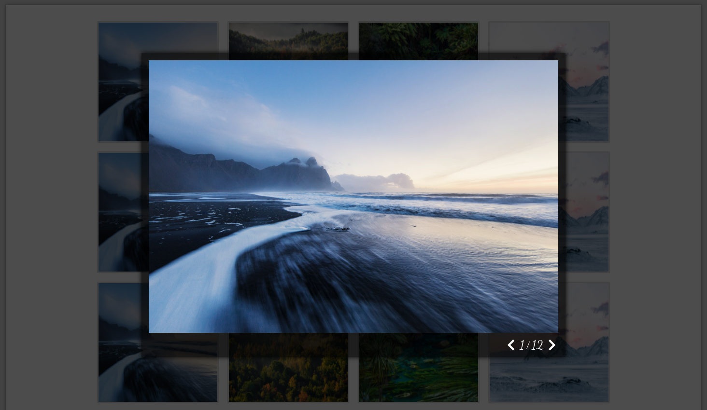
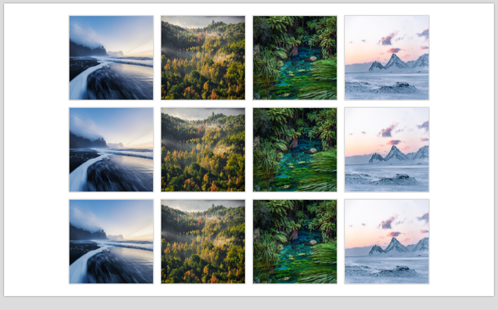

# Lightbox Gallery

Przykładowy skrypt umożliwiający zamianę pojedynczych obrazów na stronie w galerię zdjęć. Po powiększenie pojedynczego zdjęcia, skrypt umożliwia przełączanie się pomiędzy obrazami.

A sample script that allows turning single images on a page into a photo gallery. After enlarging a single picture, the script allows switching between pictures.

## Demo

https://piotrhol.github.io/Lightbox/

## Technologies

HTML, Sass, JavaScript, Webpack

## Example screenshots

- Single picture

- Main view

